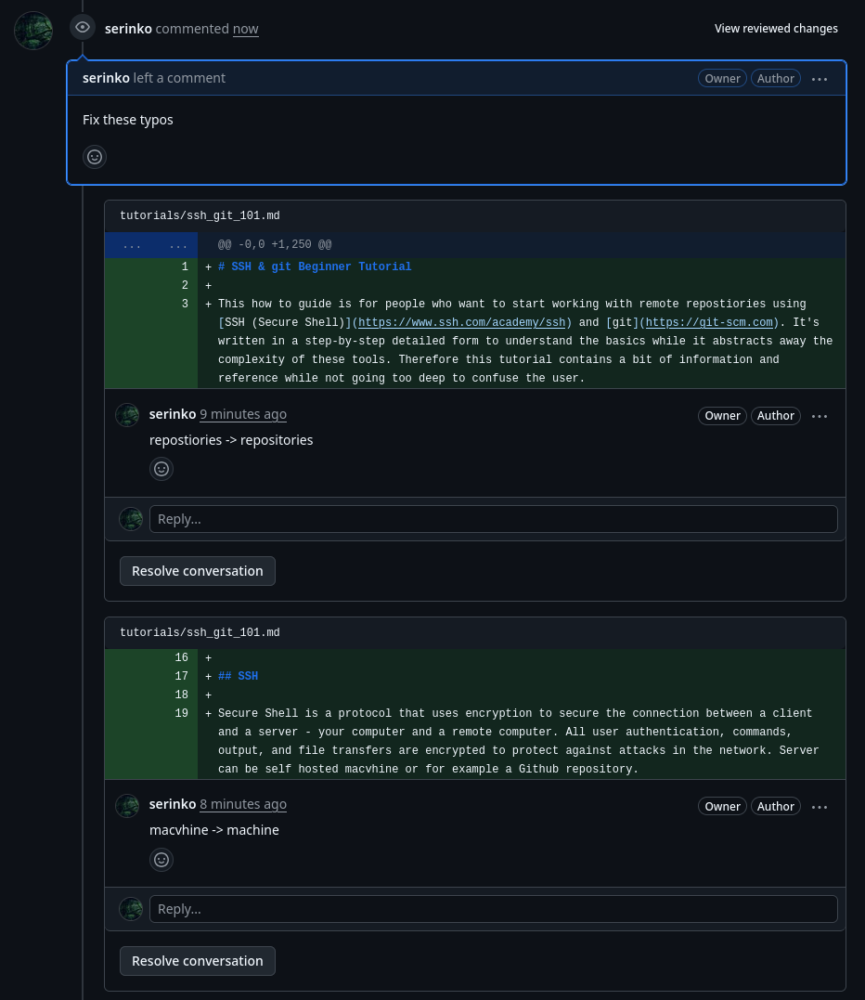
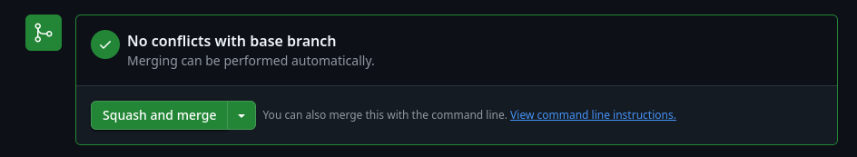

# SSH & git Beginner Tutorial

This is a how-to-guide for people who want to start working with remote repositories using [SSH (Secure Shell)](https://www.ssh.com/academy/ssh) and [git](https://git-scm.com). It's written in a detailed step-by-step fashion to explain all the basics and references for more information, while it abstracts away the complexity of these tools.

**The objective of this page is to make a user familiar with remote collaborative work flow, where all files are locally stored in their computer. This knowledge allows for working offline and in parallel from other contributors, creating own branches and merging them via Pull requests back to the base branch on the remote repository.**

## Requirements

At first it may look like a lot to digest, but it's an worth it one-time investment of time for everyone who plans to work with git. All you need is a laptop / desktop and approx 60-90 min to learn study and practice the logic.

There are a few tools we will need. This guide will explain how to download and configure them on the go later on. The tools used in the tutorial are:

- Terminal (shell) 
- Local password manager - We will use [KeepassXC](https://keepassxc.org/download/#linux) in this guide
- Text editor - We will use [VS Codium](https://vscodium.com/) in this guide
- SSH key pair - We generate one in [SSH](#ssh) chapter
- git version control tool - We will set it up in [git](#git) chapter

## SSH

**To work with repositories Secure Shell (SSH) is used to download (`git clone` or `git pull`) the work done by others and upload (`git push`) the changes done by us.**

### Quick SSH Overview

Secure Shell is a protocol that uses encryption to secure the connection between a client and a server - your computer and a remote computer. All user authentication, commands, output, and file transfers are encrypted to protect against attacks in the network. Server can be a self hosted machine or for example a Github repository. 

SSH is widely used protocol using common encryption algorthytms and simple logic to communicate between computers in a secure way. There is no need to study the logic and cryptography as the tool abstracts it all away from the user.

Every time we use SSH to connect two computers, the protocol does a few things behind the scene as it's described in the basic SSH diagram taken from [SSH documentation page](https://www.ssh.com/academy/ssh):


### SSH Setup

**Usually SSH key-pair is configured once per repository (one key can be used for as many repositories as wished). This chapter will therefore not be needed every time you work with git.**

Before we begin to setup a SSH key-pair, let's make sure we have installed and opened a password manager. In case you don't use any, start with [downloading KeePassXC](https://keepassxc.org/download/), if you have your own use that one - then this guide expects that you are familiar with adding an entry there. One way or the other, **use a password manager!**

Start with generating a SSH key-pair and store the access to it in KeePassXC, following these steps:

1. **Create a KeepassXC database if you don't have one already:**
- Open KeePassXC, click on top on create new database, follow the steps and prompts
- The password for the database is one that you will have to remember

2. **Create a new entry for you SSH key:**
- Click on the `+` icon on top
- `Title` field: Name it something like `ssh-<IDENTITY>-ed25519`, for example: `ssh-mygithubkey-ed25519`
- Generate a password in the `Password` field using the dice icon on the right side of the field
- Add your email into `Username` field - Note this email can be completely made up if you don't want to use your real email

3. **Ensure that SSH config directory (`$HOME/.ssh`) exists:**
- Run this command that finds out and creates one if needed:
```sh
mkdir -p ~/.ssh
```
- This directory is where all SSH keys and configs will be stored (unless you choose otherwise)

4. **Create your SSH key pair:**
- Open a terminal window and run the command bellow, replace values with the ones we stored in the KeePassXC for the given key:
    - `<EMAIL>` with the one in `Username` field
    - `<SSH-KEY-NAME>` with the one from `Title` field  
```sh
ssh-keygen -t ed25519 -C "<EMAIL>" -f ~/.ssh/<SSH-KEY-NAME>
```
- The process will prompt you for a password, copy-paste the one from `Password` field in the KeePassXC for the given key

5. **Configure SSH key in your KeePassXC:**
> This setting is optional but highly recommended as it means that your key will work automatically but only when your KeePassXC database is unlocked
- In the key entry click on `SSH Agent` on the left side bar
- On top tick these boxes:
    - `Add key to agent when database is opened`
    - `Remove key from agent when database is locked`
- In `Private Key` pane, add a key by `External file` clicking on `Browse` and navigating to `.ssh/` choosing the key that you just created
- Click on `Add to agent`
> **Note:** On the bottom you see a block called `Public key`. Often people who want to *add your key to the repo* will ask you for your ssh public key, just copy-paste this block and send it to them

Congratulation, you just created your SSH key pair.

## git

**git is the most commonly used tool for distributed collaboration allowing for multiple branches and offline work.**


You can read more about [git on their page](https://git-scm.com/):

> Git is a [free and open source](https://git-scm.com/about/free-and-open-source) distributed version control system designed to handle everything from small to very large projects with speed and efficiency. 

### Install git

Most Linux based systems already have git installed by default, check it out with entering this command to your terminal:
```sh
git --version
```

If git doesn't exist in your system, [download and install it](https://git-scm.com/downloads), or use your package management system (the place from where you install tools). For Debian based systems run this command from terminal:
```sh
sudo apt install git
```

### Download git Repository

**After your public SSH key was added to the repository, you can start to work remotely from your local computer. This step is always done only once per repository, from then onward you will have the repository stored on your disk.**

To download new repository (`clone`) follow these steps:

- Open your terminal in the place where your want to have the root directory of the repository (many create and use a *'source'* folder in their home called `$HOME/src/`)
- Use this command to download (`clone`) the repository to that folder, where exchange:
    - `<REPOSTIORY_URL>` with the actual repository url
    - `<USER>` and `<REPO>` with the host username and repo name
```sh
git clone git@<REPOSTIORY_URL>:<USER>/<REPO>.git
```
- Example of cloning this repo would be:
```sh
git clone git@github.com:serinko/gizmo.git
```
- Now you will have a repository root directory (in this case called `gizmo`) in the directory from where you cloned it
- You can browse, open and edit any file from that repository directly in your computer

### Configure git

**A quick git configuration of per each repository is a good convention to follow as it prevents default behaviour, especially to allow for different identities across multiple repositories. Without this little tweak, all repositories will use the global system values stored at `$HOME/.gitconfig`.** 

Right after you download the repository, configure it by tweaking a file stored at `<REPOSITORY_ROOT_FOLDER>.git/config` (in our case `gizmo/.git/config`). 

> **Note:** A nickname and email is visible by other contributors and in case of a public repo - by everyone. 

To configure your nickname and email, follow these steps:

- Navigate to the root directory of the repository and open the `.git/config` in your favourite text editor. 

- There should be a part called `[user]`, looking like this:
```toml
[user]
        email = some@email.me
        name = serinko
```
- Change the values to the ones you want to have displayed next to your commits in this particular repository

- In case this block is not in the config file, copy-paste it there with your own values

- Save and exit

### Working with git Repository

**Below is a table with some ommonly used git syntax, jargon and examples.**

| Name | Function | Command Syntax |Command Example |
| :-- | :-- | :-- | :-- |
| *Clone* | Download repository for the first time | `git clone git@<REPOSTIORY_URL>:<USER>/<REPO>.git` | `git clone git@github.com:serinko/gizmo.git` |
| *Status* | Shows a state of my work in relation to the git repository | `git status` | `git status` |
| *Pull* | Download latest remote changes of the repository | `git pull` | `git pull origin master` |
| *Branch off / Fork* | Creates a new branch separated from the main one | `git checkout -b "<NEW_BRANCH_NAME>"` |  `git checkout -b "serinko/feature/new-tutorial"` |
| *Add* | Adds or removes file(s) from git tracking | `git add <PATH_TO_FILE>` | `git add .` |
| *Commit* | Store your changes on the current branch | `git commit -am "<SHORT_DESCRIPTION>"` | `git commit -am "intialise ssh git tutorial"` |
| *Push* | Uploads my commits up to the remote so others can see them | `git push origin <MY_BRANCH_NAME>` | `git push origin serinko/feature/new-tutorial` |

> **Note:** If during `git pull` or `git push` commands you see a message like: `Enter passphrase for key path/key ...` you may have your KeepassXC locked. Hit `ctrl` + `c` in terminal to cancel the command process, unlock your KeePassXC and redo the command.

#### Basic Work Flow

Once we cloned the repository, it stays in our computer. However, other people have been making changes on their computers, pushing it up to the remote. Therefore for this to work in the cleanest way possible, we need to follow a common logic. In the simplest form it goes like this:

1. `git status` - Always start with informing yourself about the current state of the repository. In case your status shows your last working branch - make sure to switch to the main working one first:
- `git checkout <MAIN_COMMON_BRANCH>` - For example `git checkout master` or `git checkout main` - depends what's the base branch for the given repository 
2. `git pull` - Pull the current state of the common branch from the remote
3. `git checkout -b "<NEW_BRANCH_NAME>"` - Branch off from the latest common state into your own branch
4. Make changes on files and save them
5. If you added or removed files run `git add .` from the root repo directory
6. `git commit -am "<SHORT_DESCRIPTION>"` - After every significant change and file save, record it to git using commits
7. Repeat steps 4-6 as many times as needed
8. `git push origin <NEW_BRANCH_NAME>` - When you want your branch to be visible to others (or public in case of puclic repo) push the changes up
9. Create a Pull request - described in the example flow right under

#### Example: git Flow with Github

There are many instances of git web hosting interfaces like [Codeberg](https://codeberg.org/), [GitLab](https://about.gitlab.com/), [NoLog](https://code.nolog.cz/) and [Github](https://github.com). From privacy and free software point of view, Codeberg or NoLog are be the best picks for you. This flow uses Github as an example as this is where this repository lives and it's the most commonly used one. 

For demonstration, I will demonstrate the flow by adding this very guide to the repository, using the [flow documented above](#simple-work-flow). Given that I already have the repository on my computer, I will skip the [download](#download-git-repository) and [configure](#configure-git) parts and go straight to the work flow.

> **Tip:** You can use the in-build terminal in [VS Codium](https://vscodium.com/) where you also edit text. If you prefer other text editor and a standalone terminal, use that.

1. In terminal: Navigate to the root folder of the repo:
```sh
cd $HOME/src/gizmo
```
> **Tip:** Command `cd` stands for *change directory* and it's one of the most commonly used terminal commands. It's always handy to know [fundamental shell tools / commands](https://www.digitalocean.com/community/tutorials/linux-commands)

2. `git status` to check the repository status, my output is:
```
On branch master
Your branch is up to date with 'origin/master'.

nothing to commit, working tree clean
```
- Great! I am on `master` without any untrailed changes

3. `git checkout -b "feature/ssh-git-101-tutorial"` to create a new branch called `feature/ssh-git-101-tutorial`, the output is:
```
Switched to a new branch 'feature/ssh-git-101-tutorial'
```

4. Do my changes:
- Create `tutorials` directory - you can do it in your file system, in VS Codium or by this command:
```sh
mkdir tutorials
```
- Open a text editor and create a file called `ssh_git_101.md`, save it directly empty
- Write my initial version of text to this point and save it

3. Add this new file (and directory) - open terminal (standalone or in VS Codium), make sure it's in `gizmo` repo directory and run:
```sh
# to add all new or removed files in all sub-directories:
git add .

# alternatively add just this one file
git add tutorials/ssh_git_101.md
```

4. Commit my changes:
```sh
git commit -am "intialise ssh git tutorial"
```
- The output:
```
[feature/ssh-git-101-tutorial a82141a] intialise ssh git tutorial
 1 file changed, 199 insertions(+)
 create mode 100644 tutorials/ssh_git_101.md
```

5. Do more work - like writing this sentence and following points and follow the flow of:
- Save files
- Add if needed
- Commit changes

6. Push: When my writing is finished for the day I push it up:
```sh
git push origin feature/ssh-git-101-tutorial
```
- The output:
```
Enumerating objects: 9, done.
Counting objects: 100% (9/9), done.
Delta compression using up to 16 threads
Compressing objects: 100% (6/6), done.
Writing objects: 100% (8/8), 5.24 KiB | 5.24 MiB/s, done.
Total 8 (delta 3), reused 0 (delta 0), pack-reused 0
remote: Resolving deltas: 100% (3/3), completed with 1 local object.
remote:
remote: Create a pull request for 'feature/ssh-git-101-tutorial' on GitHub by visiting:
remote:      https://github.com/serinko/gizmo/pull/new/feature/ssh-git-101-tutorial
remote:
To ssh://github_serinko/serinko/gizmo.git
 * [new branch]      feature/ssh-git-101-tutorial -> feature/ssh-git-101-tutorial
```
- Pay a special attention to the message with the generated link:
```
remote: Create a pull request for 'feature/ssh-git-101-tutorial' on GitHub by visiting:
remote:      https://github.com/serinko/gizmo/pull/new/feature/ssh-git-101-tutorial
```

7. Create a Pull Request (PR): Visit the Github url from previous point and edit the PR description:
- At first the PR page is rather empty:


- I will edit it so there is:
    - A simple Title and useful description of the PR
    - Assining myself as PR owner
    - If the repo had a reviewer I would choose one 
    - Add a Label
    - Ensure that comparison on top is to the right base branch where I eventually want to merge to
    - Change `Create pull request` to `Draft pull request` (as I do want to publish this state but don't want it to be reviewed just yet) and click on it
- The result


8. Finish my works: Save files, add (as I created a new dir with images isnce the last commits), commit, push, check status ... repeat steps above as many times as I need on as many files within the repo as needed

9. Click on `Ready for Review`

10. Notify the reviewer and wait for their comments if there is something to be changed

11. Check the review comments, they should be descriptive and paired with the file name and line



12. Make changes in local files, save them, commit, push - then go back to the Pull Request page (in this case the url is: [`https://github.com/serinko/gizmo/pull/1`](https://github.com/serinko/gizmo/pull/1) ) and *Resolve all conversations*

13. Merge the PR: If all tests on Github pass and the PR is approoved, click on Merge button, chosing `Squash and merge` from the drop down menu.



**Now the changes are part of the base branch!**

## Conventions & Tips

To make this work with as little hick-ups as possible, make sure that you match with the convention culture in the team you collaborate with. Some of useful tips may be:

- Before you create your own branch (`git checkout -b <NEW_BRANCH_NAME>`), make sure that you are on the branch from which you want to fork off, pulled it's latest state and your status is clean

- Learn good commit description convention, either by asking senior people in the team for advice or applyting [something like this](https://www.conventionalcommits.org/en/v1.0.0/)
